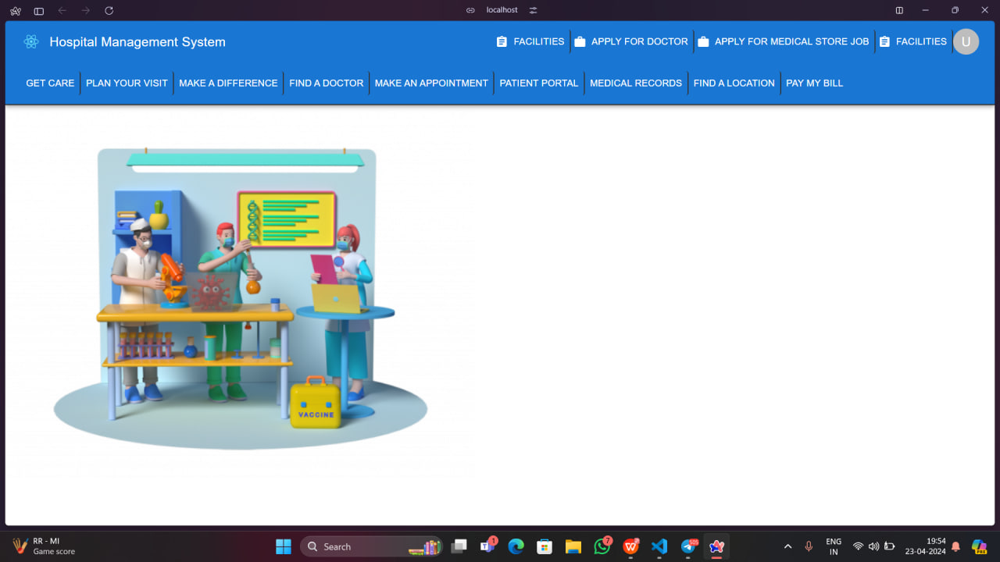

Hospital Management System (HMS)
Welcome to the Hospital Management System (HMS) project! This system is designed to streamline various aspects of hospital operations, from patient management to staff administration.

Features
User Registration: Register new users, including patients, employees, and administrators.
Appointment Scheduling: Book and manage appointments with doctors.
Medical Records Management: Maintain and access patient medical records securely.
Inventory Management: Manage inventory of medical supplies and equipment.
Billing and Payments: Generate bills and process payments for services.
Reporting: Generate reports on various aspects of hospital operations.
Installation
Clone the repository:

git clone https://github.com/yourusername/hospital-management-system.git
Navigate to the project directory:

cd hospital-management-system
Install dependencies:

npm install
Start the development server:

npm start
Technologies Used
Frontend: React.js, Material-UI
Backend: Node.js, Express.js
Database: MongoDB
Authentication: JWT (JSON Web Tokens)
Contributing
Contributions are welcome! If you find any issues or have suggestions for improvements, feel free to open an issue or submit a pull request.
## Screenshots

